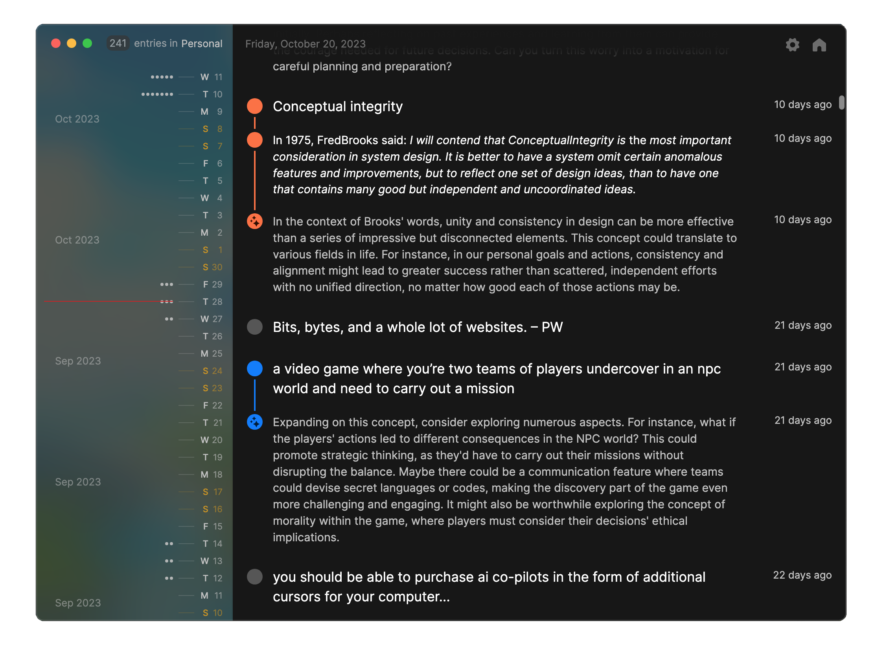

# Pile

Pile is a desktop app for reflective journaling. It's about simplicity, keeping your data local, and enhancing your journaling experience with AI.

## Getting started

1. Download the latest version of Pile by going to the [Pile releases page](https://github.com/UdaraJay/Pile/releases/).
2. On macOS Open the `.zip` or `.dmg` file and drag the application to the destination of your choice (_optional_), such as your `Applications/` folder. On Windows, use the `.exe` to install.
3. Finally open the application, create a `New Pile`, and start your reflective journey.

### AI reflections (requires OpenAI API access, or Ollama for local AI)

Enhance your journaling experience by integrating OpenAI's GPT AI reflections into Pile. If you have access to OpenAI's GPT-4 API, you can use your API key to:

- **Reflect on entries:** Click "reflect" on any written entry to get AI-generated insights and thoughts as a reply in the thread.
- **Search or ask questions:** Click the "reflect" icon on the top-right of the window to search or ask question about your entire journal.

**How to setup AI features:** head over to [platform.openai.com/api-keys](https://platform.openai.com/api-keys) and create a new API key. Click the settings icon on the top-right corner of Pile and enter your secret API key into the API key field.

Before you use the AI-powered features within this app, we strongly recommend that you [configure a spending limit within OpenAI's interface](https://platform.openai.com/account/limits) to prevent unexpected costs.

## Contributing

If you'd like to contribute to Pile, feel free to fork the repository, make your changes, and submit a pull request. Contributions are welcomed and appreciated, however this is an experimental project, so any changes and new features are merged into this distribution of Pile at my discretion.

For a detailed guide on contributing, read the [CONTRIBUTING.md](CONTRIBUTING.md) file.

## License
The software code is licensed under the MIT License. 
The brand name, and other brand assets are proprietary and not included in the MIT license. 

See the [LICENSE.md](LICENSE.md) file for details.

## Special thanks

Many thanks and appreciation to all these people and projects for their contributions to Pile.

- [Zach Bogart](https://twitter.com/zachbogart): for the icon design.
- [Electron react boilerplate](https://github.com/electron-react-boilerplate/electron-react-boilerplate): for making it easier to launch desktop apps.
