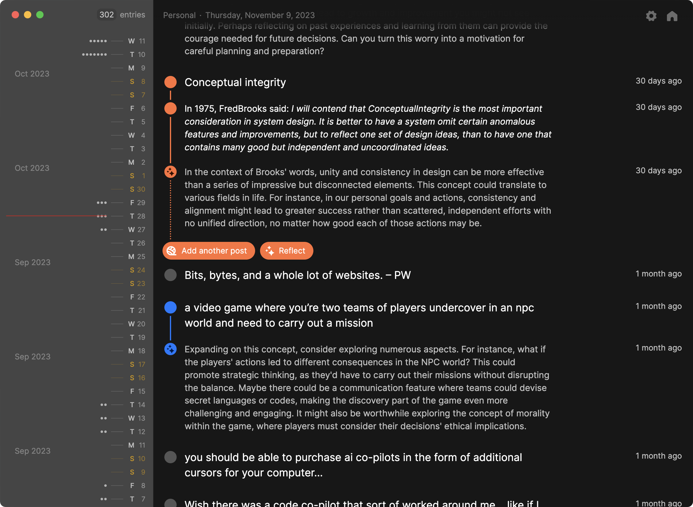

# Pile

Pile is a desktop app for reflective journaling. It store your data locally on your computer, works over markdown files, and is free.

# Credits

Many thanks and appreciation to all these people and projects for their contributions to Pile.

- [Zach Bogart](https://twitter.com/zachbogart): for the icon design.
- [Electron react boilerplate](https://github.com/electron-react-boilerplate/electron-react-boilerplate): for making it easier to launch desktop apps.
